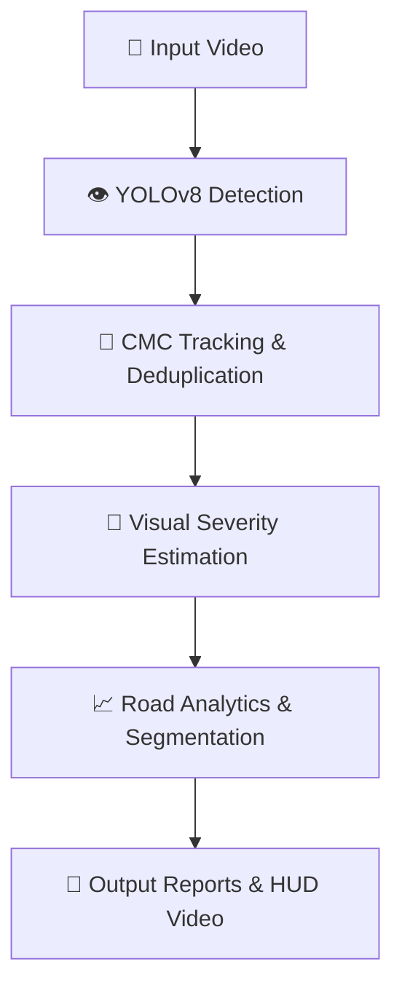

<div align="center">
  
**Intelligent Pothole Detection & Road Damage Analysis Pipeline**

[](https://www.python.org/downloads/)
[](https://ultralytics.com/)
[](https://opencv.org/)
[](https://opensource.org/licenses/MIT)

</div>

<br />

## 📖 Overview
This is an end-to-end computer vision pipeline designed to automate road damage assessment from standard monocular video footage. Rather than simply drawing bounding boxes on individual frames, the system implements custom **temporal association tracking** and **geometric analysis** to convert a moving stream of detections into a stable, accurate, and actionable road condition report.

<br />

## 🚀 Key Features

* **🎯 High-Speed Pothole Detection**: Robust detection of road surface damage using a custom-trained YOLOv8 model.
* **🛡️ Persistent Tracking (CMC)**: A custom Camera Motion Compensation tracker isolates true camera motion from object motion, preventing double-counting of potholes.
* **🔢 Unique Pothole Counting**: Provides an accurate, deduplicated count of unique physical defects passed by the vehicle.
* **📏 Relative Visual Severity**: Evaluates damage purely on track-level geometric features (max span, max area, persistence) to naturally combat perspective distortion, without requiring stereo cameras or depth sensors.
* **📊 Segment Analytics**: Divides the route into temporal segments to isolate the most degraded sections of the road.
* **📄 Machine-Readable Reports**: Automatically exports `pothole_measurements.csv` and `road_report.json` for downstream integration.

<br />

## 🏗️ Architecture Pipeline

The core architecture processes video through five distinct layers:



<br />

## ⚙️ Performance & Benchmarks

The system was benchmarked on highly degraded test footage (`sample.mp4`, 1280x720, 25 FPS, 375 frames) running on a standard CPU. 

### 🏆 Model Selection
* **YOLOv8 Pothole Detector**: Selected as the primary detection engine after benchmarking against YOLO26. It provided superior practical detection coverage on highly damaged roads and significantly faster processing speeds.
* **YOLO26 Pothole Detector**: Retained in the architecture design as a secondary reference/benchmark model, but deprecated in the final release for streamlined performance.

### ⏱️ Final Metrics (YOLOv8)
| Metric | Value |
| :--- | :--- |
| **Raw Detections** | 3,149 |
| **Unique Pothole Tracks** | 122 |
| **Frames w/ Detections** | 100% |
| **End-to-End FPS** | ~4.89 FPS* |

*\*Processing FPS includes decoding, inference, tracking, annotation, and encoding on CPU.*

<br />

## 📂 Project Structure

```text
RoadVision-AI/
├── input/                  # Source videos
├── output/                 # Final videos, CSV reports, JSON, charts
├── src/
│   ├── analytics/          # PSI calculation and temporal segmentation
│   ├── severity/           # Relative Visual Severity extraction
│   ├── tracking/           # Custom CMC Tracker
│   ├── benchmark.py        # Model benchmarking suite
│   ├── detector.py         # YOLO inference wrapper
│   ├── main.py             # CLI entry point
│   └── video_processor.py  # Core processing and annotation loop
├── README.md               # You are here
└── requirements.txt        # Python dependencies
```

<br />

## 💻 Installation

1. **Clone the repository:**
   ```bash
   git clone https://github.com/shazimjaved/Advance-Pothole-Detection-System.git
   cd Advance-Pothole-Detection-System
   ```
2. **Create and activate a virtual environment (Recommended):**
   ```bash
   python -m venv .venv
   source .venv/bin/activate  # On Windows: .venv\Scripts\activate
   ```
3. **Install dependencies:**
   ```bash
   pip install -r requirements.txt
   ```

<br />

## 🚦 Usage

Run the complete pipeline on a video using the CLI. The required model weights will be automatically downloaded from the Hugging Face Hub on the first run.

```bash
python -m src.main --model yolov8 --track --input input/sample.mp4
```

### 📦 Outputs Generated
The pipeline generates the following files directly in the `output/` directory:
* **`yolov8_result.mp4`**: The final annotated video featuring color-coded bounding boxes, persistent IDs, and a live HUD tally.
* **`pothole_measurements.csv`**: A detailed breakdown of every confirmed pothole, including its maximum observed width, height, area, and final severity score.
* **`road_summary.csv`**: Aggregated statistics broken down by video segment.
* **`road_report.json`**: A complete, machine-readable JSON summary of the overall road condition.
* **`segment_analysis.png`**: A visualization chart showing the degradation of the road over time.

<br />

## ⚠️ Current Limitations
* **Monocular RGB Video**: The system relies entirely on standard 2D video.
* **No Physical Depth Measurement**: It is impossible to calculate true physical depth (Z-axis) from a single 2D camera without a known reference point.
* **Relative/Visual Severity**: Severity is a heuristic calculation based on pixel-geometry and persistence. It is highly effective for visual sorting but is not a physical measurement.
* **No GPS**: The system currently tracks time/frames, not physical distance.
* **No True Distance-Based Density**: Metrics like "Potholes per Kilometer" cannot be calculated without speed or GPS data.
* **Heuristic Thresholds**: Severity classification thresholds (Minor/Moderate/Severe) are configurable estimates.
* **Limited Validation Dataset**: Currently validated on a limited set of heavily degraded road footage.

<br />

## Future Improvements
* ** GPS Integration**: Overlaying real-time telemetry to map exact pothole coordinates.
* **Distance-Normalized Density**: Calculating true "Potholes per Kilometer" using OBD2 speed data or GPS velocity.
* ** Depth Estimation**: Integrating monocular depth-estimation models (e.g., MiDaS, Depth Anything) to approximate volumetric severity.
* **Instance Segmentation**: Moving from bounding boxes to polygon masks for exact pixel-area calculation.
* ** Real-Time Deployment**: Optimizing the tracker and inference engine for edge devices (e.g., Jetson Nano) for live vehicle deployment.
* ** Broader Validation**: Expanding the test dataset to include varied lighting, weather, and road types.
